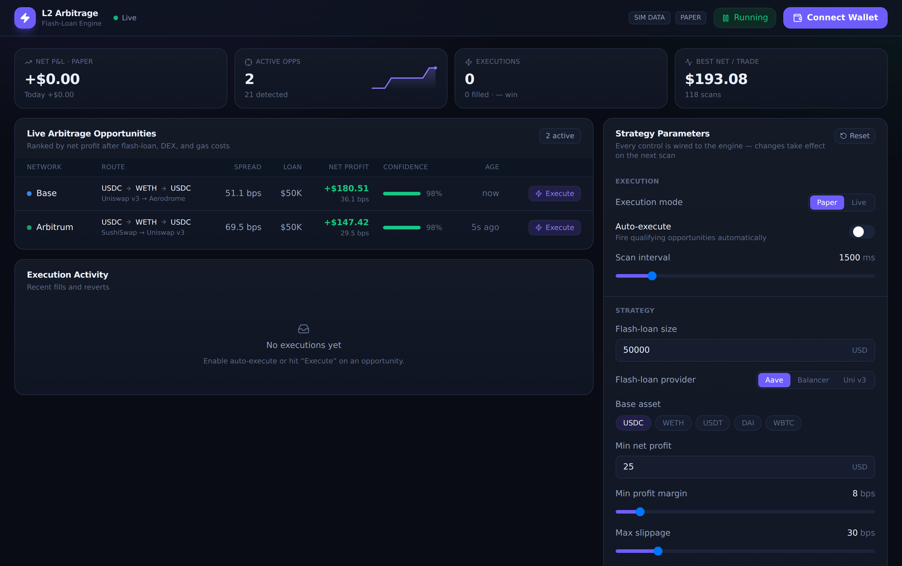

<div align="center">

# ⚡ L2 Arbitrage GUI

**A plug-and-play, real-time dashboard for Layer-2 flash-loan arbitrage.**

Live opportunity streaming · every parameter wired to the backend · MetaMask
integration · a language-agnostic API · and a built-in autonomous build harness.



</div>

---

> [!IMPORTANT]
> **Safe by default.** Ships in **paper / simulation mode** — opportunities and
> fills are modelled and **no transactions are broadcast**. Real on-chain
> execution is deliberately gated (see [Safety](#-safety)). Flash-loan arbitrage
> involves real financial and smart-contract risk. Nothing here is financial advice.

## Why this exists

Building an arbitrage front-end usually means gluing together a wallet library, a
websocket feed, a settings UI, and a backend — each with its own edge cases. This
repo gives you all of it, working together and tested end-to-end:

- **Real-time opportunities.** A scanning engine streams profitable dislocations
  over WebSocket as they appear, ranked by net profit after flash-loan, DEX, and
  gas costs.
- **Every control is wired.** Change the loan size, profit threshold, slippage,
  networks, DEX venues, risk limits — validated on the backend and effective on
  the **next scan**, no restart, uniformly across every data source (including
  the real `external` production feed, not just the simulated demo). Settings
  also **survive a restart** (`backend/.data/settings.json`) — only
  `executionMode` always re-seeds from `EXECUTION_MODE` on boot, the one
  deliberate exception (see [Safety](#-safety)).
- **MetaMask + L2.** Connect via wagmi/viem; switch between Base, Arbitrum,
  Optimism, and Polygon.
- **Any language can drive it.** The GUI has no privileged backdoor — it's all a
  documented REST + WebSocket API, with JS and Python SDKs and an OpenAPI spec.
- **Autonomous improvement.** A [Ralph loop](ralph/README.md) harness keeps
  building the product toward its spec, one verified commit at a time.

## Quickstart

```bash
# 1. Install (pnpm workspaces)
pnpm install

# 2. Run backend + frontend together
pnpm dev
#   frontend → http://localhost:5173
#   backend  → http://localhost:8787  (REST + ws://…/ws)
```

Or with Docker, one command:

```bash
docker compose up --build
# open http://localhost:8080
```

No configuration is required — it runs in simulation mode out of the box.

## Architecture

```
l2-arbitrage-gui/
├── backend/     Node + TS · Express REST + ws WebSocket · pluggable arbitrage
│                engine (simulated + live providers) · validated live-reload
│                settings · paper/live executor split · OpenAPI contract
├── frontend/    React + TS + Vite + Tailwind v4 · wagmi/viem (MetaMask) ·
│                live opportunities table · KPI tiles · wired settings panel
├── sdk/         Language-agnostic clients (js, python) over the same API
├── ralph/       Autonomous build-loop harness (prompt, spec, backlog, guardrails)
└── docs/        Assets and documentation
```

Data flows one way and stays consistent: **UI / SDK → REST/WS → SettingsStore →
Engine → WebSocket fan-out → every connected client.**

## Configuration

Configuration comes from the **single master `.env` at the repo root** — copy
`../.env.example` to `../.env` and edit its *Dashboard* section. The backend and
the Vite frontend both read it automatically; a local `dashboard/.env` still
overrides it, and real environment variables (including what the launcher
injects) override both. Everything has safe defaults.

| Variable | Default | Purpose |
|----------|---------|---------|
| `PORT` | `8787` | Backend REST + WS port |
| `DATA_SOURCE` | `simulated` | `simulated` (no keys) or `live` (real DEX feeds) |
| `EXECUTION_MODE` | `paper` | `paper` (simulate) or `live` (gated real execution) |
| `RPC_URL_BASE` / `_ARBITRUM` / `_OPTIMISM` / `_POLYGON` | — | RPCs for live data |
| `VITE_API_URL` | same-origin | Where the frontend reaches the backend |

## API & SDKs

The full contract lives in [`backend/openapi.yaml`](backend/openapi.yaml).

```
GET   /api/health · /api/networks · /api/settings · /api/opportunities · /api/stats
PATCH /api/settings          # live-tune parameters, immediate effect
POST  /api/execute/:id       # execute an opportunity (paper/live per mode)
WS    /ws                    # snapshot + opportunity/stats/execution/settings/alert stream
```

Drive it from any language — see [`sdk/`](sdk/README.md) for the JS and Python
clients, or generate one from the OpenAPI spec.

```js
import { L2ArbitrageClient } from "@l2/sdk";
const client = new L2ArbitrageClient({ baseUrl: "http://localhost:8787" });
await client.updateSettings({ minProfitUsd: 40, loanAmountUsd: 100_000 });
client.subscribe((msg) => msg.type === "opportunity" && console.log(msg.payload));
```

## The Ralph harness

[`ralph/`](ralph/README.md) is a self-contained autonomous build loop: point a
coding agent at one prompt and it iterates toward [`ralph/SPEC.md`](ralph/SPEC.md),
taking the top item off [`ralph/backlog.md`](ralph/backlog.md), implementing it,
running the verify gate, and committing — with fresh context each iteration.

```bash
ralph/ralph.sh --dry-run --once   # prove the harness + run the full verify gate
ralph/ralph.sh --once             # one real iteration (needs a coding-agent CLI)
```

## Testing

```bash
pnpm verify      # typecheck + tests + build across all packages
pnpm test        # unit tests (backend: 76 · frontend: 28)
```

The engine, settings store, REST API, formatters, live-state reducer, and UI
primitives are all covered. The frontend is verified visually via a Playwright
screenshot pass.

## 🔒 Safety

- **Paper by default.** `executionMode=paper` and `autoExecute=false` at first run.
- **Live execution is double-gated.** It requires `EXECUTION_MODE=live` **and**
  `executionMode: "live"` in settings, and `LiveExecutor` still refuses to run
  until a deployed, audited flash-loan contract, a funded signer, and MEV
  protection are wired in — none of which are enabled here.
- **No secrets in the repo.** RPC URLs and keys come from the environment only.
- **Bounded inputs.** Every setting is validated and range-checked server-side, so
  no client can push the engine into an unsafe state.

Flash-loan arbitrage carries real financial and smart-contract risk. Audit any
contract and test on testnets before risking funds. This software is provided
as-is under the MIT license; nothing here is financial advice.

## Roadmap

Tracked in [`ralph/backlog.md`](ralph/backlog.md): real DEX quoting for live data,
a PnL-over-time chart, API-key auth, gated live-execution preflight,
Playwright E2E, and more.

## License

[MIT](LICENSE)
