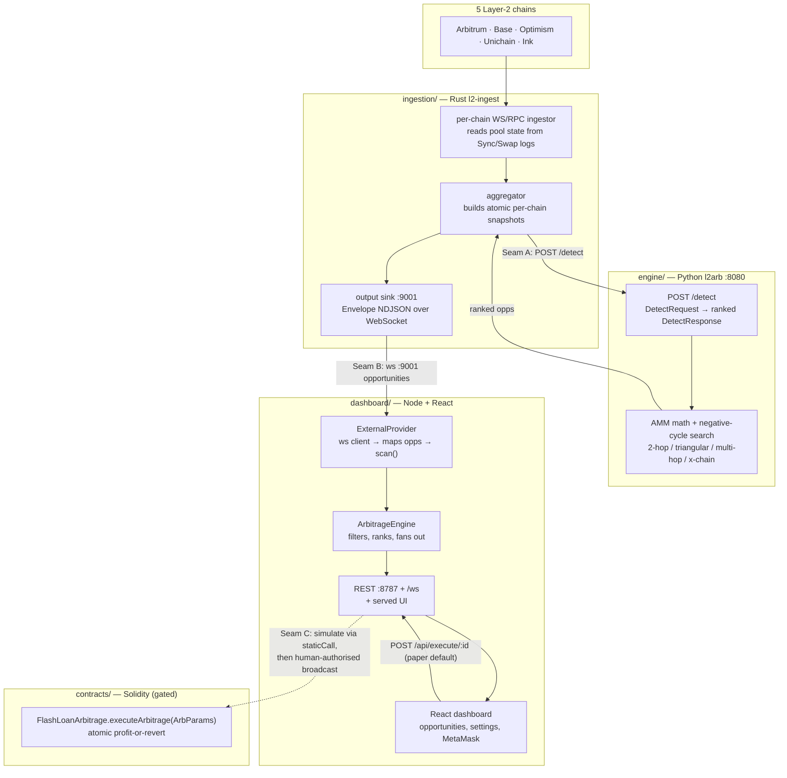

# Architecture

The L2 Arbitrage Flash-Loan Bot is a **ports-and-adapters pipeline** assembled
from four independently-tested components. Data flows one way — from live
on-chain state to a ranked, block-stamped opportunity on your screen — and, only
under explicit human authorisation, to an atomic on-chain execution.

## Data flow



## Ports

| Service | Bind | Purpose |
|---------|------|---------|
| engine | `127.0.0.1:8080` | `POST /detect`, `GET /health` (read-only) |
| ingestion | `:9001` | WebSocket opportunity feed (Envelope frames) |
| ingestion | `:9090` / `:9100` | health / Prometheus metrics |
| dashboard | `127.0.0.1:8787` | REST `/api/*`, WebSocket `/ws`, served UI |

## The three integration seams

### Seam A — ingestion → engine  *(pre-existing contract)*
`l2-ingest` assembles a `DetectRequest` (per-chain gas/price context + pool
state, big-ints as decimal strings) and POSTs it to `/detect`. The engine returns
a ranked `DetectResponse`. Configured in `ingestion` `[engine]`
(`http_url`, `detect_path`, `top_n`, `max_hops`, cadence). The engine is
**read-only**: it prices and ranks; it never executes.

### Seam B — ingestion → dashboard  *(built in this merge)*
The ingestion output sink broadcasts a versioned envelope as one NDJSON WebSocket
text frame per update:

```json
{ "schema_version": 1, "kind": "opportunities",
  "chain_blocks": { "8453": 20536112 },
  "payload": { "count": 3, "opportunities": [ /* engine opportunities */ ] } }
```

The dashboard's **`ExternalProvider`**
(`dashboard/backend/src/arbitrage/providers/external.ts`) is a WebSocket client
that:
1. connects to `INGEST_FEED_URL` (default `ws://127.0.0.1:9001`), reconnecting
   with backoff;
2. for each `kind:"opportunities"` frame, maps every engine opportunity onto the
   dashboard's `ArbitrageOpportunity` via `engineMap.ts` (block-stable id, route
   per hop, numeraire-scaled figures) and buffers it;
3. hands the freshest batch to the engine's pull-based `scan()` loop, which
   applies the user's live profit/risk filters and fans results out over `/ws`.

Select it with `DATA_SOURCE=external`. **Honesty note:** engine amounts are
numeraire base units; the `…Usd` fields are true dollars only when the numeraire
is a stablecoin — no ETH/price is fabricated. `profitBps`, `confidence`, and the
route are numeraire-agnostic and exact.

### Seam C — dashboard → contracts  *(gated execution)*
`POST /api/execute/:id` runs the **paper** executor by default (models fills,
never broadcasts). Real execution targets
`contracts/FlashLoanArbitrage.sol::executeArbitrage(ArbParams)` — an atomic
executor that reverts unless `generated ≥ owed + minProfit`, validates every
flash-loan callback (`msg.sender == pool && initiator == this`), and is gated by
`EXECUTOR_ROLE` + `Pausable`. The safe pattern (per `contracts/docs/INTEGRATION.md`)
is **simulate via `eth_call`/`staticCall`** — a revert means "not profitable
now" — **then hand an unsigned transaction to a human-authorised signer**. The
bot never holds keys and never broadcasts.

## Orchestration

Two equivalent ways to run the wired stack:

- **`launcher/`** (primary, smoke-tested): `python -m l2arb run` starts the
  services in order (engine → ingestion → dashboard), health-gates each, serves
  the built UI on one origin (`SERVE_STATIC_DIR`), opens the browser, and then
  hands off to a **continuous health monitor** — a live terminal HUD that probes
  each service's process *and* its `/health` endpoint every tick, self-diagnoses
  faults (exit code + last log lines, or "up but unresponsive"), and **self-heals**
  by restarting a crashed or wedged process with exponential backoff and a bounded
  restart budget. A service it can't recover is isolated as `failed` while the rest
  keep running; a clean Ctrl-C stops everything. Recovery restarts infrastructure
  only — it never signs, submits, or re-broadcasts anything (execution stays
  paper-by-default and human-gated). Paper mode needs only the dashboard; `--live`
  runs all three.
- **`docker-compose.yml`** (container alternative): four services on one network
  (`engine`, `ingestion`, `backend`, `frontend`), pre-wired with
  `DATA_SOURCE=external` and `INGEST_FEED_URL=ws://ingestion:9001`.

## Why merged this way

- **Contracts, not rewrites.** Each component still builds and tests on its own;
  the merge connects them at their existing typed boundaries (the `/detect` JSON
  contract and the Envelope feed). Adding a chain or DEX remains an adapter, not a
  refactor.
- **One artifact, isolated failure domains.** The launcher (and the `.exe` it
  becomes) is a single entry point, but each service is its own supervised
  process — one dying doesn't panic the others; the health monitor restarts it
  (backoff + bounded budget) and, if it can't be recovered, isolates it as
  `failed` while the rest keep running.
- **Safety preserved across the seam.** Detection-only engine, paper-by-default
  execution, and "real on-chain data only" survive the merge unchanged; the
  dashboard's mapper is written to never fabricate data.
